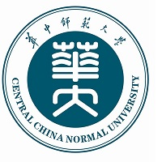

## About Me

I'm currently a *junior* undergraduate student at the [School of Mathematics and Statistics](https://maths.ccnu.edu.cn/), [Central China Normal University](https://www.ccnu.edu.cn/), pursuing a Bachelor’s degree in *Statistics*.

My current interests lie at the intersection of **statistics, artificial intelligence, and healthcare**. I am particularly interested in how reliable machine learning methods and LLMs can support medical research.

With a background in statistics, I'm building a solid foundation in mathematics while strengthening my ability to conduct research through hands-on research practice. I plan to pursue an AI-related direction in my future M.S. or Ph.D. studies.

<b><i style="color: #043361!important;">I'm open to research opportunities in related areas, while also exploring the research directions that I'm most passionate about for the future.</i></b>

<b><i style="color: #ed0e1d!important;">Last updated on <time datetime="2026-09-05">September 5, 2026</time>.</i></b>

## Research Interests

- **Medical AI:** Building practical and reliable medical AI tools that can assist real-world clinical and research workflows.
- **Trustworthy Machine Learning:** Studying reliability, interpretability, and robustness of AI systems in high-stakes medical scenarios.
- **Large Language Models for Healthcare:** Exploring how large language models can support medical research assistance and safer AI applications.

## News

<ul class="dated-list">
  <li>
    <time datetime="2026-03" aria-label="March 2026">2026Mar</time>
    Started conducting research in medical artificial intelligence. Hope my first publication will come soon.
  </li>
</ul>

## Education

  

    
<strong>Central China Normal University</strong>, 2024-Present. 
    Undergraduate Student, majoring in <strong>Statistics</strong>. 
    School of Mathematics and Statistics, Wuhan, China.

  

  <!-- Official seal: https://www.ccnu.edu.cn/xxgk/hdbs.htm -->
  







## Honors & Awards

<ul class="dated-list">
  <li>
    <time datetime="2026-10" aria-label="October 2026">2026Oct</time>
    Merit Student, Central China Normal University.
  </li>
  <li>
    <time datetime="2026-06" aria-label="June 2026">2026Jun</time>
    First Prize, Zhengda Cup National College Student Market Research and Analysis Competition.
  </li>
  <li>
    <time datetime="2025-11" aria-label="November 2025">2025Nov</time>
    First Prize, Contemporary Undergraduate Mathematical Contest in Modeling (CUMCM).
  </li>
  <li>
    <time datetime="2025-10" aria-label="October 2025">2025Oct</time>
    First-class Scholarship, Central China Normal University (<strong>the only recipient in my major</strong>).
  </li>
  <li>
    <time datetime="2025-08" aria-label="August 2025">2025Aug</time>
    First Prize, APMCM.
  </li>
</ul>

## Skills & Language

- **IELTS:** 7.0.
- **CET-4:** 658/710, **CET-6:** 631/710.
- Native speaker of **Mandarin**, with basic **Cantonese** proficiency; currently learning basic **German**.
- **Programming Languages:** Python, MATLAB, R, SQL.
- **Technical Skills:** PyTorch, Hugging Face Transformers, Git, Linux, LATEX.

## Contact

I am open to research opportunities and collaborations. If you have gone through a similar transition toward AI-related research, or are considering one, I would be happy to connect and exchange ideas.

**Please feel free to contact me by [email](mailto:troytu90@gmail.com).**

## Misc

- Beyond the screen, when I am not debugging code or proving theorems, you will often find me on the track. I see *running* as a wonderful way to relieve stress and clear my mind.
- I am a big fan of Hong Kong films, such as *Cold War*, and I always enjoy discussing the details behind the stories.
- *Music* has always been a companion in my life. I especially love David Tao's songs.
- I am also trying to write on Zhihu, mainly about interesting ideas, research experiences, and problems I encounter along the way.
- More details will be added as my research projects continue to develop.
